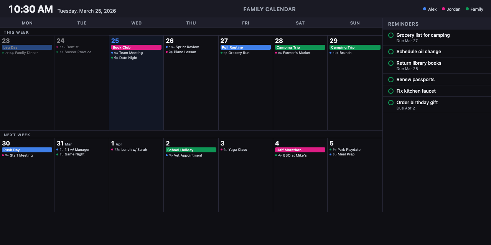

# Family Calendar Display



Always-on wall-mounted calendar and reminders display for Raspberry Pi (Zero 2 W through Pi 5) connected to a 21"+ LCD monitor or 4K TV. Unifies **Google Calendar**, **iCloud Calendar**, **Microsoft Outlook Calendar**, **Apple Reminders**, **Google Tasks**, and **Microsoft To Do** into a single at-a-glance view.

## Features

- **Two-week calendar grid** — Monday through Sunday, this week and next
- **All-day events** as colored chips inside each day cell
- **Timed events** with colored dots, time, and title
- **Reminders sidebar** — Apple Reminders (via Shortcuts webhook) + Google Tasks + Microsoft To Do
- **Multi-source sync** — Google Calendar API + iCloud CalDAV + Microsoft Graph API, every 5 minutes, with automatic calendar discovery (new subscriptions like holidays are picked up automatically)
- **Persistent cache** — Calendar events and reminders survive server restarts (instant display on boot)
- **Admin panel** at `/admin` — GUI setup wizard for connecting accounts + display/system settings
- **Responsive viewport scaling** — Layout fills any resolution (720p, 1080p, 4K) with identical proportions; optional fine-tuning via display scale (0.5×–3×)
- **System monitoring** — CPU, memory, disk, temperature, fan speed, and throttling status in the admin panel (auto-refreshes, Pi-specific thermal data auto-detected)
- **Weather forecasts** — daily high/low temperatures and conditions icon in each day cell, current temperature in the header (via [Open-Meteo](https://open-meteo.com), free, no API key)
- **Light/dark themes** with 8 color palettes (Default, Nord, Ocean, Forest, Sunset, Rose, Slate, Mocha) — auto-switch by fixed hours or local sunrise/sunset
- **Network security** — IP allowlist, rate limiting, security headers
- **Raspberry Pi kiosk mode** — boots directly into fullscreen Chromium
- **Display schedule** — Screen on/off times and active days, configurable from admin GUI
- **macOS launcher apps** — double-click to start/stop the server
- **LG webOS app** — sideloadable package for LG smart TVs

## Tech Stack

| Layer | Technology |
|-------|-----------|
| Backend | Node.js 18+, [Fastify 5](https://fastify.dev) |
| Frontend | Vanilla HTML/CSS/JS (no build step) |
| Google Calendar | [googleapis](https://www.npmjs.com/package/googleapis) OAuth2 |
| Google Tasks | [googleapis](https://www.npmjs.com/package/googleapis) Tasks API |
| iCloud Calendar | [tsdav](https://www.npmjs.com/package/tsdav) CalDAV + [ical.js](https://www.npmjs.com/package/ical.js) |
| Microsoft Calendar | [Microsoft Graph API](https://learn.microsoft.com/en-us/graph/api/resources/calendar) OAuth2 (zero dependencies — built-in `fetch()`) |
| Microsoft To Do | [Microsoft Graph API](https://learn.microsoft.com/en-us/graph/api/resources/todotask) |
| Apple Reminders | Webhook from [Apple Shortcuts](https://support.apple.com/guide/shortcuts/welcome/ios) |
| Scheduling | [node-cron](https://www.npmjs.com/package/node-cron) |
| Display | Chromium or Epiphany kiosk mode on Raspberry Pi OS |

## Quick Start

### 1. Install dependencies

```bash
npm install
```

### 2. Configure credentials

**Option A: GUI Setup (recommended)**

Start the server (`npm start`) and visit [http://localhost:3000/admin](http://localhost:3000/admin). The **Accounts** tab walks you through connecting Google, iCloud, and Microsoft calendars. Credentials are stored encrypted on disk.

**Option B: Manual .env Setup**

```bash
cp .env.example .env
```

Edit `.env` with your credentials:

- **Google Calendar** — Create OAuth2 credentials in [Google Cloud Console](https://console.cloud.google.com/apis/credentials), then run `npm run auth:google` to get a refresh token
- **iCloud Calendar** — Generate an [app-specific password](https://appleid.apple.com) (Sign-In and Security > App-Specific Passwords)
- **Microsoft Calendar** — Register an app in [Azure App Registrations](https://portal.azure.com/#view/Microsoft_AAD_RegisteredApps/ApplicationsListBlade) (free, no Azure subscription needed), create a client secret, and use the GUI setup wizard
- **Apple Reminders** — Set any shared secret; you'll use it when creating the Shortcut

### 3. Run

```bash
npm start
# or with auto-reload for development:
npm run dev
```

Open [http://localhost:3000](http://localhost:3000) for the calendar display and [http://localhost:3000/admin](http://localhost:3000/admin) for settings.

## Apple Reminders Setup

Apple Reminders don't have a public API. This project uses an Apple Shortcut that runs on your iPhone to push reminders to the server via webhook.

See **[SHORTCUTS-SETUP.md](SHORTCUTS-SETUP.md)** for step-by-step instructions.

## Deployment Options

### Raspberry Pi 4/5 (recommended for always-on display)

On a fresh Raspberry Pi OS Lite (64-bit), run this one-liner over SSH:

```bash
curl -fsSL https://raw.githubusercontent.com/CleverTrou/family-calendar/main/deploy/pi-setup.sh | sudo bash
```

This clones the repo, installs Node.js, Chromium, a minimal X11 stack, and configures:
- **Auto-start** — Calendar launches at boot in fullscreen kiosk mode
- **Display schedule** — Screen turns off at night, back on in the morning (configurable from the admin GUI, per day-of-week)
- **Cursor hiding** — Mouse cursor hidden after idle
- **Crash recovery** — Chromium auto-restarts if it crashes

### Raspberry Pi Zero 2 W / Pi 3B+ (low-memory boards)

For boards with 512MB–1GB RAM, use the lightweight setup script:

```bash
curl -fsSL https://raw.githubusercontent.com/CleverTrou/family-calendar/main/deploy/pi-zero-setup.sh | sudo bash
```

Differences from the standard setup:
- **Epiphany browser** instead of Chromium (~150MB less RAM)
- **256MB swap file** configured automatically
- **Lightweight mode** enabled — syncs every 15 min, frontend polls every 2 min
- **Node.js heap limited** to 128MB to prevent OOM
- **Node.js 18 LTS** (lighter than 20+)

> **Note:** The original Pi Zero W (ARMv6, 32-bit) is not supported — Node.js 18+ requires a 64-bit or ARMv7+ processor.

### macOS (development or temporary display)

Double-click launcher apps in `deploy/`:
- **Family Calendar.app** — Starts the server and opens the calendar in your browser
- **Stop Calendar.app** — Stops the running server

Generate the apps with `deploy/generate-mac-icon.sh`.

### LG Smart TVs (webOS)

A lightweight webOS app package is available in `deploy/webos-app/` for LG smart TVs. The TV connects to your calendar server over the local network.

See **[deploy/webos-app/README.md](deploy/webos-app/README.md)** for setup instructions.

> **Note:** OLED TVs are not recommended for always-on display due to burn-in risk. Best used as an on-demand display.

## Project Structure

```
family-calendar/
├── src/
│   ├── server.js              # Fastify server entry point
│   ├── config.js              # Environment config with defaults
│   ├── routes/
│   │   ├── api.js             # GET /api/calendar, /api/health, /api/settings, /api/display/status, /api/system/stats
│   │   ├── auth.js            # OAuth2 callback routes (Google + Microsoft)
│   │   ├── accounts.js        # Account CRUD (connect, test, disconnect)
│   │   └── webhooks.js        # POST /api/reminders/sync
│   └── services/
│       ├── admin-auth.js      # PIN-based admin authentication
│       ├── calendar-store.js  # Event cache + sync orchestration
│       ├── credential-store.js # Encrypted credential storage (AES-256-GCM)
│       ├── google-calendar.js # Google Calendar API client
│       ├── google-tasks.js    # Google Tasks API client
│       ├── icloud-calendar.js # iCloud CalDAV client
│       ├── microsoft-graph.js # Microsoft Graph API helper (auth, token refresh, pagination)
│       ├── microsoft-calendar.js # Microsoft Outlook Calendar client
│       ├── microsoft-tasks.js # Microsoft To Do client
│       ├── reminders.js       # Unified reminders store (Apple + Google + Microsoft)
│       ├── settings.js        # User preferences (JSON file)
│       ├── sync-scheduler.js  # Cron-based sync loop
│       └── weather.js         # Weather forecasts (Open-Meteo API)
├── data/                      # Runtime data (gitignored)
│   ├── credentials.enc        # Encrypted provider credentials
│   ├── events-cache.json      # Persisted calendar events across restarts
│   └── reminders-cache.json   # Persisted reminders across restarts
├── frontend/
│   ├── index.html             # Main calendar display
│   ├── admin.html             # Settings panel
│   ├── css/
│   │   ├── styles.css         # Calendar + reminders styles
│   │   └── admin.css          # Admin panel styles
│   └── js/
│       ├── app.js             # Main loop: fetch data, render, update clock
│       ├── calendar-view.js   # Two-week grid renderer
│       ├── reminders-view.js  # Reminders sidebar renderer
│       ├── admin.js           # Admin panel logic
│       ├── sun-calc.js        # Sunrise/sunset calculator (NOAA algorithm)
│       ├── themes.js          # Color theme palettes (8 themes, light+dark)
│       └── utils.js           # Date parsing, formatting, color mapping
├── deploy/
│   ├── pi-setup.sh            # Raspberry Pi 4/5 kiosk setup script
│   ├── pi-zero-setup.sh       # Pi Zero 2 W / Pi 3B+ lightweight setup
│   ├── display-agent.sh       # Screen on/off agent (polls server schedule)
│   ├── display-agent.service  # Systemd service for display agent
│   ├── generate-mac-icon.sh   # Generate macOS .app launchers
│   └── webos-app/             # LG smart TV app package
├── scripts/
│   └── google-auth.js         # One-time Google OAuth2 token helper
├── .env.example               # Template for credentials
└── SHORTCUTS-SETUP.md         # Apple Shortcuts setup guide
```

## Configuration

All configuration is via environment variables in `.env`:

| Variable | Default | Description |
|----------|---------|-------------|
| `PORT` | `3000` | Server port |
| `HOST` | `0.0.0.0` | Bind address (`127.0.0.1` for localhost only) |
| `SYNC_INTERVAL_MINUTES` | `5` (`15` in lightweight) | How often to re-fetch calendars |
| `DISPLAY_TIMEZONE` | `America/New_York` | Timezone for date display |
| `LIGHTWEIGHT_MODE` | `false` | Reduce resource usage for Pi Zero 2 W / Pi 3B+ |
| `CALENDAR_DAYS_BACK` | `7` | Days in the past to fetch events |
| `CALENDAR_DAYS_FORWARD` | `14` | Days in the future to fetch events |
| `ADMIN_PIN` | *(none)* | Optional numeric PIN to protect `/admin` |
| `CREDENTIAL_SECRET` | *(auto)* | Encryption key for credential store (auto-generated) |
| `WEATHER_LAT` | *(none)* | Latitude for weather + sunrise/sunset (or set via admin GUI) |
| `WEATHER_LON` | *(none)* | Longitude for weather + sunrise/sunset (or set via admin GUI) |

### Network Security

| Variable | Default | Description |
|----------|---------|-------------|
| `ALLOWED_NETWORKS` | *(none)* | Comma-separated CIDR ranges to allow (e.g., `10.0.0.0/24,127.0.0.1`) |

When `ALLOWED_NETWORKS` is set, requests from IPs outside those ranges receive `403 Forbidden`. The admin PIN endpoint is also rate-limited to 5 attempts per minute.

**Recommended `.env` for a home network:**

```bash
ALLOWED_NETWORKS=192.168.1.0/24,127.0.0.1
# or for 10.x networks:
ALLOWED_NETWORKS=10.0.0.0/24,127.0.0.1
# add Tailscale if you use it:
ALLOWED_NETWORKS=10.0.0.0/24,127.0.0.1,100.64.0.0/10
```

## License

MIT
