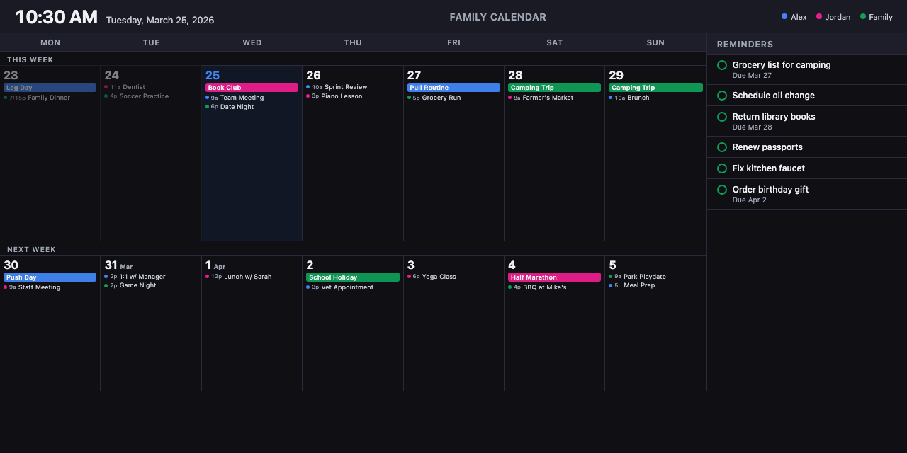

# Family Calendar Display



Always-on wall-mounted calendar and reminders display for Raspberry Pi (Zero 2 W through Pi 5) connected to a 21"+ LCD monitor or 4K TV. Unifies **Google Calendar**, **iCloud Calendar**, **Microsoft Outlook Calendar**, **ICS/iCal feed URLs**, **Apple Reminders**, **Google Tasks**, and **Microsoft To Do** into a single at-a-glance view.

## Features

- **Two-week calendar grid** — this week and next, with a Monday or Sunday first-column option
- **All-day events** as colored chips inside each day cell
- **Timed events** with colored dots, time, and title
- **Reminders sidebar** — Apple Reminders (via Shortcuts webhook) + Google Tasks + Microsoft To Do
- **ICS feed support** — Paste any ICS/iCal feed URL (Google Calendar secret address, Outlook.com published calendar, etc.) — no developer account needed, read-only
- **Multi-source sync** — Google Calendar API + iCloud CalDAV + Microsoft Graph API + ICS feeds, every 5 minutes, with automatic calendar discovery (new subscriptions like holidays are picked up automatically)
- **Persistent cache** — Calendar events and reminders survive server restarts (instant display on boot)
- **Admin panel** at `/admin` — GUI setup wizard for connecting accounts + display/system settings
- **Responsive viewport scaling** — Layout fills any resolution (720p, 1080p, 4K) with identical proportions; optional fine-tuning via display scale (0.5×–3×)
- **System monitoring** — CPU, memory, disk, temperature, fan speed, throttling status, and live server logs in the admin panel (auto-refreshes, Pi-specific thermal data auto-detected)
- **Weather forecasts** — daily high/low temperatures and conditions icon in each day cell, current temperature in the header (via [Open-Meteo](https://open-meteo.com), free, no API key)
- **Light/dark themes** with 9 color palettes (Default, Nord, Ocean, Forest, Sunset, Rose, Slate, Mocha, Kitchen Paper) — auto-switch by fixed hours or local sunrise/sunset
- **Display styles** that change the layout's look independently of color: **Default** (clean grid, no decoration), **Kitchen Paper** (the default: warm paper texture, pastel event pills with a colored left border, dashed dividers, rounded cards, a halo around today's cell) and **Japandi** (minimal, quiet, restrained)
- **Typeface pairings** tuned for distance legibility: System (OS default, no web fonts), Editorial (Fraunces · Inter), Mincho (Shippori Mincho), Gothic (Zen Kaku Gothic New), Newsreader, and Grotesk (IBM Plex Sans · Plex Mono numerals)
- **Network security** — IP allowlist, rate limiting, security headers
- **Raspberry Pi kiosk mode** — boots directly into fullscreen Chromium
- **Display schedule** — Screen on/off times and active days, configurable from admin GUI. Optional **HDMI-CEC TV control** wakes the TV and switches to the Pi's input at boot and at schedule-on (and returns it to standby at schedule-off) — opt-in per install, so it's safe to skip on shared/bedroom TVs
- **macOS launcher apps** — double-click to start/stop the server
- **LG webOS app** — sideloadable package for LG smart TVs
- **Samsung Tizen app** — sideloadable package for Samsung smart TVs

## Tech Stack

| Layer | Technology |
|-------|-----------|
| Backend | Node.js 18+, [Fastify 5](https://fastify.dev) |
| Frontend | Vanilla HTML/CSS/JS (no build step) |
| Google Calendar | [googleapis](https://www.npmjs.com/package/googleapis) OAuth2 |
| Google Tasks | [googleapis](https://www.npmjs.com/package/googleapis) Tasks API |
| iCloud Calendar | [tsdav](https://www.npmjs.com/package/tsdav) CalDAV + [ical.js](https://www.npmjs.com/package/ical.js) |
| ICS Feeds | [ical.js](https://www.npmjs.com/package/ical.js) — any standard iCalendar URL |
| Microsoft Calendar | [Microsoft Graph API](https://learn.microsoft.com/en-us/graph/api/resources/calendar) OAuth2 (zero dependencies — built-in `fetch()`) |
| Microsoft To Do | [Microsoft Graph API](https://learn.microsoft.com/en-us/graph/api/resources/todotask) |
| Apple Reminders | Webhook from [Apple Shortcuts](https://support.apple.com/guide/shortcuts/welcome/ios) |
| Scheduling | [node-cron](https://www.npmjs.com/package/node-cron) |
| Display | Chromium or Epiphany kiosk mode on Raspberry Pi OS |

## Quick Start

### 1. Install dependencies

```bash
npm install
```

### 2. Configure credentials

**Option A: GUI Setup (recommended)**

Start the server (`npm start`) and visit [http://localhost:3000/admin](http://localhost:3000/admin). The **Accounts** tab walks you through connecting calendars. The easiest option is **Add Calendar Feed (ICS URL)** — just paste a read-only feed URL from Google Calendar or Outlook.com settings, no developer account needed. For full integration (auto-discovery, tasks), connect Google, iCloud, or Microsoft accounts directly. Credentials are stored encrypted on disk.

**Option B: Manual .env Setup**

```bash
cp .env.example .env
```

Edit `.env` with your credentials:

- **Google Calendar** — See **[GOOGLE-SETUP.md](GOOGLE-SETUP.md)** for full walkthrough (or use an ICS feed URL for quick setup)
- **iCloud Calendar** — Generate an [app-specific password](https://appleid.apple.com) (Sign-In and Security > App-Specific Passwords)
- **Microsoft Calendar** — See **[MICROSOFT-SETUP.md](MICROSOFT-SETUP.md)** for full walkthrough (or use an ICS feed URL for quick setup)
- **Apple Reminders** — Set any shared secret; you'll use it when creating the Shortcut

### 3. Run

```bash
npm start
# or with auto-reload for development:
npm run dev
```

Open [http://localhost:3000](http://localhost:3000) for the calendar display and [http://localhost:3000/admin](http://localhost:3000/admin) for settings.

## Apple Reminders Setup

Apple Reminders don't have a public API. This project uses an Apple Shortcut that runs on your iPhone to push reminders to the server via webhook.

See **[SHORTCUTS-SETUP.md](SHORTCUTS-SETUP.md)** for step-by-step instructions.

## Deployment Options

### Raspberry Pi 4/5 (recommended for always-on display)

On a fresh Raspberry Pi OS Lite (64-bit), run this one-liner over SSH:

```bash
curl -fsSL https://raw.githubusercontent.com/CleverTrou/family-calendar/main/deploy/pi-setup.sh | sudo bash
```

This clones the repo, installs Node.js, Chromium, a minimal X11 stack, and configures:
- **Auto-start** — Calendar launches at boot in fullscreen kiosk mode
- **Display schedule** — Screen turns off at night, back on in the morning (configurable from the admin GUI, per day-of-week)
- **Cursor hiding** — Mouse cursor hidden after idle
- **Crash recovery** — Chromium auto-restarts if it crashes

### Raspberry Pi Zero 2 W / Pi 3B+ (low-memory boards)

For boards with 512MB–1GB RAM, use the lightweight setup script:

```bash
curl -fsSL https://raw.githubusercontent.com/CleverTrou/family-calendar/main/deploy/pi-zero-setup.sh | sudo bash
```

Differences from the standard setup:
- **Epiphany browser** instead of Chromium (~150MB less RAM)
- **256MB swap file** configured automatically
- **Lightweight mode** enabled — syncs every 15 min, frontend polls every 2 min
- **Node.js heap limited** to 128MB to prevent OOM
- **Node.js 18 LTS** (lighter than 20+)

> **Note:** The original Pi Zero W (ARMv6, 32-bit) is not supported — Node.js 18+ requires a 64-bit or ARMv7+ processor.

### macOS (development or temporary display)

Double-click launcher apps in `deploy/`:
- **Family Calendar.app** — Starts the server and opens the calendar in your browser
- **Stop Calendar.app** — Stops the running server

Generate the apps with `deploy/generate-mac-icon.sh`.

### LG Smart TVs (webOS)

A lightweight webOS app package is available in `deploy/webos-app/` for LG smart TVs. The TV connects to your calendar server over the local network.

See **[deploy/webos-app/README.md](deploy/webos-app/README.md)** for setup instructions.

> **Note:** OLED TVs are not recommended for always-on display due to burn-in risk. Best used as an on-demand display.

### Samsung Smart TVs (Tizen)

A Tizen app package is available in `deploy/tizen-app/` for Samsung smart TVs (2015+ models). Same thin-client approach — the TV connects to your calendar server over the local network.

See **[deploy/tizen-app/README.md](deploy/tizen-app/README.md)** for setup instructions.

> **Samsung The Frame** TVs work particularly well as always-on calendar displays. QLED panels are safe for extended use; OLED panels carry burn-in risk.

## Recommended Pi Companion Setup

These aren't required by Family Calendar but pair well with a Pi running as a permanent wall display.

### Automatic Upgrades

Install `unattended-upgrades` to apply updates overnight without manual `apt upgrade` runs:

```bash
sudo apt install unattended-upgrades
sudo dpkg-reconfigure -plow unattended-upgrades   # enables the daily run
```

Know what Raspberry Pi OS's default configuration allows before relying on it. `/etc/apt/apt.conf.d/50unattended-upgrades` permits **Debian-Security and the Raspberry Pi Foundation archive**, not security alone. That archive carries the kernel, firmware, `rpi-eeprom` and **Chromium**, so the kiosk browser updates itself, often every few days. To hold those for manual review instead, remove the `Raspberry Pi Foundation` line from `Unattended-Upgrade::Origins-Pattern`. The trade-off: that archive also ships the kernel and firmware security fixes. Preview a run with `sudo unattended-upgrade --dry-run -d`.

Two things it never does: upgrade software installed outside apt (nvm, npm globals, pipx, anything built from source), or flash the bootloader. A new `rpi-eeprom` package only stages an image. Apply it with `sudo rpi-eeprom-update -a && sudo reboot`.

### Glances System Monitor

[Glances](https://github.com/nicolargo/glances) is a web-based system monitor. On a headless Pi it gives you CPU, memory, temperature, disk and processes from any browser on your network, without SSH. Its web mode needs FastAPI and Uvicorn, which it doesn't depend on, so inject them:

```bash
pipx install glances
pipx inject glances fastapi uvicorn
glances -w    # web UI on :61208
```

Upgrade with `pipx upgrade --include-injected glances`. A plain `pipx upgrade` leaves the injected web stack behind.

Two caveats:

- **There is no apt plugin in Glances 4.** Older guides, including earlier versions of this README, say to enable pending-upgrade reporting with an `[apt]` section in `glances.conf`. Glances silently ignores it: `/api/4/pluginslist` has no `apt`, and `/api/4/apt` returns 400. Use `apt list --upgradable`, or the notifications below.
- **`--bind ::` is IPv6-only.** Glances' web server is Uvicorn, which sets `IPV6_V6ONLY` on an IPv6 bind, so that flag drops IPv4 rather than adding IPv6. For dual-stack (useful when Tailscale MagicDNS hands clients an IPv6 address first), bind Glances to `127.0.0.1` on another port and put `socat TCP6-LISTEN:61208,fork,reuseaddr,ipv6only=0 TCP4:127.0.0.1:<port>` in front of it.

The web UI and its REST API are unauthenticated, including the full process list. Run `glances -w --password` once interactively to save a hashed password, then add `--password` to however you launch it.

### ntfy Push Notifications

[ntfy](https://ntfy.sh) is a lightweight HTTP push notification service. Small cron scripts watch for pending package updates and push to your phone. Pick a long, unguessable topic name, because anyone who knows a topic can read it. Subscribe to it in the ntfy iOS/Android app.

#### nvm and global npm package updates

`deploy/pi-maintenance/check-nvm-npm-updates` checks nvm itself (via GitHub releases API) and all globally installed npm packages (via `npm outdated -g`) weekly, sending a single ntfy notification listing anything outdated. It covers npm, corepack, and any other package installed with `npm install -g`.

Deploy once, replacing both placeholders:

```bash
scp deploy/pi-maintenance/check-nvm-npm-updates your-pi.local:~/bin/
ssh your-pi.local 'chmod +x ~/bin/check-nvm-npm-updates && \
  (crontab -l 2>/dev/null | grep -v -e check-nvm-npm -e NTFY_TOPIC_URL; \
   echo "NTFY_TOPIC_URL=https://ntfy.sh/YOUR_TOPIC_HERE"; \
   echo "0 9 * * 1 $HOME/bin/check-nvm-npm-updates") | crontab -'
```

The script reads `NTFY_TOPIC_URL` from the crontab environment, so there's no need to edit the script itself. It **refuses to run** if the variable is unset or still `YOUR_TOPIC_HERE`, rather than posting to a placeholder topic anyone could read.

**Re-copy it after pulling updates.** The `scp` copy doesn't follow the repo. Older copies of this script fell back to the public `ntfy.sh/YOUR_TOPIC_HERE` topic when the variable was unset, and a copy deployed before that fix keeps doing so until it's replaced. Check what's installed with `grep -n YOUR_TOPIC ~/bin/check-nvm-npm-updates`.

### UxPlay — AirPlay Receiver

[UxPlay](https://github.com/FDH2/UxPlay) turns the Pi into an AirPlay 2 receiver, making it appear as a destination in the AirPlay picker on all Apple devices on your network.

- **Audio only** (e.g. Apple Music): plays through the TV speakers while Family Calendar stays visible
- **Video + audio** (e.g. screen mirroring): opens a window over the calendar display

The Debian package lags behind upstream, so build from source for the latest version and security fixes. The same block covers a first install and every upgrade, and it's written to be pasted whole into an SSH session:

```bash
(
  set -eo pipefail
  sudo apt install -y curl git build-essential cmake pkg-config libplist-dev libssl-dev \
    libavahi-client-dev libavahi-compat-libdnssd-dev \
    libgstreamer1.0-dev libgstreamer-plugins-base1.0-dev libdbus-1-dev libx11-dev \
    gstreamer1.0-plugins-base gstreamer1.0-plugins-good gstreamer1.0-plugins-bad \
    gstreamer1.0-libav gstreamer1.0-gl gstreamer1.0-x   # runtime: decode, sound, X11 output
  TAG=$(curl -fsS https://api.github.com/repos/FDH2/UxPlay/releases/latest | sed -n 's/.*"tag_name": *"\([^"]*\)".*/\1/p')
  [ -n "$TAG" ] || { echo "could not read the latest UxPlay tag" >&2; exit 1; }
  SRC=$(mktemp -d)
  trap 'rm -rf -- "$SRC"' EXIT   # cleans up on failure too, not only on success
  git clone --depth 1 --branch "$TAG" https://github.com/FDH2/UxPlay.git "$SRC"
  cmake -S "$SRC" -B "$SRC/build" -DCMAKE_BUILD_TYPE=Release
  make -C "$SRC/build" -j4
  sudo make -C "$SRC/build" install   # /usr/local/bin/uxplay
  if [ -f /etc/systemd/system/uxplay.service ]; then sudo systemctl restart uxplay; fi
  uxplay -v
)
```

The `( set -eo pipefail … )` wrapper stops at the first failure without ending your SSH session. It builds in a fresh temporary directory, because a fixed `./UxPlay` breaks on the next upgrade, and it restarts the service so the new binary is actually the one running.

Run it as a systemd service under your user account (required for X11 display access):

```ini
# /etc/systemd/system/uxplay.service
[Unit]
Description=UxPlay AirPlay Server
After=network.target

[Service]
Type=simple
User=<your-username>
Environment=DISPLAY=:0
Environment=XAUTHORITY=/home/<your-username>/.Xauthority
ExecStart=/usr/local/bin/uxplay -n "Family Room" -p -nofreeze -fs -scrsv 1
Restart=always
RestartSec=5

[Install]
WantedBy=multi-user.target
```

```bash
sudo systemctl daemon-reload && sudo systemctl enable --now uxplay
```

| Flag | Why |
|------|-----|
| `-n "Family Room"` | Name in the AirPlay picker (UxPlay appends `@hostname` unless you add `-nh`) |
| `-p` | Fixed legacy ports (TCP 7000/7001/7100, UDP 6000/6001/7011), so a firewall rule can name them |
| `-nofreeze` | After a client goes quiet, don't leave the last mirrored frame frozen over the calendar |
| `-fs` | Mirror full screen |
| `-scrsv 1` | Suppress the screensaver only while video is showing, so the display schedule stays in charge otherwise |

## Project Structure

```
family-calendar/
├── src/
│   ├── server.js              # Fastify server entry point
│   ├── config.js              # Environment config with defaults
│   ├── routes/
│   │   ├── api.js             # /api/calendar, /api/health, /api/settings (GET+PUT), /api/sync (POST), /api/display/status, /api/system/stats, /api/logs
│   │   ├── auth.js            # OAuth2 callback routes (Google + Microsoft)
│   │   ├── accounts.js        # Account CRUD (connect, test, disconnect)
│   │   └── webhooks.js        # POST /api/reminders/sync
│   └── services/
│       ├── admin-auth.js      # PIN-based admin authentication
│       ├── calendar-store.js  # Event cache + sync orchestration
│       ├── credential-store.js # Encrypted credential storage (AES-256-GCM)
│       ├── encrypted-store.js # Shared AES-256-GCM helpers for credentials + cached events/reminders
│       ├── google-calendar.js # Google Calendar API client
│       ├── google-tasks.js    # Google Tasks API client
│       ├── ics-calendar.js     # ICS feed URL client (read-only calendar subscriptions)
│       ├── icloud-calendar.js # iCloud CalDAV client
│       ├── log-buffer.js      # In-memory log ring buffer for admin log viewer
│       ├── microsoft-graph.js # Microsoft Graph API helper (auth, token refresh, pagination)
│       ├── microsoft-calendar.js # Microsoft Outlook Calendar client
│       ├── microsoft-tasks.js # Microsoft To Do client
│       ├── net-utils.js       # Shared CIDR/IP helpers (IP allowlist + SSRF guard)
│       ├── reminders.js       # Unified reminders store (Apple + Google + Microsoft)
│       ├── safe-fetch.js      # DNS-pinned fetch() guard against SSRF for ICS feed URLs
│       ├── settings.js        # User preferences (JSON file)
│       ├── sync-scheduler.js  # Cron-based sync loop
│       └── weather.js         # Weather forecasts (Open-Meteo API)
├── data/                      # Runtime data (gitignored)
│   ├── credentials.enc        # Encrypted provider credentials
│   ├── events-cache.enc       # Encrypted calendar events, persisted across restarts
│   └── reminders-cache.enc    # Encrypted reminders, persisted across restarts
├── frontend/
│   ├── index.html             # Main calendar display
│   ├── admin.html             # Settings panel
│   ├── css/
│   │   ├── styles.css         # Calendar + reminders styles
│   │   └── admin.css          # Admin panel styles
│   └── js/
│       ├── app.js             # Main loop: fetch data, render, update clock
│       ├── calendar-view.js   # Two-week grid renderer
│       ├── reminders-view.js  # Reminders sidebar renderer
│       ├── admin.js           # Admin panel logic
│       ├── sun-calc.js        # Sunrise/sunset calculator (NOAA algorithm)
│       ├── themes.js          # 9 color palettes (light+dark), 3 display styles, 6 typeface pairings
│       └── utils.js           # Date parsing, formatting, color mapping
├── deploy/
│   ├── pi-setup.sh            # Raspberry Pi 4/5 kiosk setup script
│   ├── pi-zero-setup.sh       # Pi Zero 2 W / Pi 3B+ lightweight setup
│   ├── display-agent.sh       # Screen on/off agent (polls server schedule)
│   ├── display-agent.service  # Systemd service for display agent
│   ├── display-on/off.*       # Legacy fixed-time timers, replaced by display-agent (setup scripts disable them)
│   ├── family-calendar.service # Systemd unit for the server
│   ├── openbox-autostart.sh   # Kiosk session: blanking off, cursor hiding, HDMI-CEC wake, browser (Epiphany if installed, else Chromium)
│   ├── pi-maintenance/        # check-nvm-npm-updates: weekly ntfy push for nvm + global npm updates
│   ├── generate-mac-icon.sh   # Generate macOS .app launchers
│   ├── tizen-app/             # Samsung smart TV app package
│   └── webos-app/             # LG smart TV app package
├── scripts/
│   └── google-auth.js         # One-time Google OAuth2 token helper
├── .env.example               # Template for credentials
├── GOOGLE-SETUP.md            # Google Calendar & Tasks setup guide
├── MICROSOFT-SETUP.md         # Microsoft Calendar & To Do setup guide
└── SHORTCUTS-SETUP.md         # Apple Shortcuts setup guide
```

## Configuration

All configuration is via environment variables in `.env`:

| Variable | Default | Description |
|----------|---------|-------------|
| `PORT` | `3000` | Server port |
| `HOST` | `::` | Bind address. `::` is dual-stack (IPv4 + IPv6) on Linux; use `127.0.0.1` for localhost only |
| `SYNC_INTERVAL_MINUTES` | `5` (`15` in lightweight) | How often to re-fetch calendars |
| `DISPLAY_TIMEZONE` | `America/New_York` | Timezone for date display |
| `LIGHTWEIGHT_MODE` | `false` | Reduce resource usage for Pi Zero 2 W / Pi 3B+ |
| `CALENDAR_DAYS_BACK` | `7` | Days in the past to fetch events |
| `CALENDAR_DAYS_FORWARD` | `14` | Days in the future to fetch events |
| `ADMIN_PIN` | *(none)* | PIN to protect `/admin`, settings, system stats, and logs — **strongly recommended** |
| `CREDENTIAL_SECRET` | *(auto)* | Encryption key for the credential store and cached events/reminders (auto-generated on first run) |
| `REMINDERS_WEBHOOK_SECRET` | *(none)* | Shared secret for `POST /api/reminders/sync` — set a strong random value |
| `WEATHER_LAT` | *(none)* | Latitude for weather + sunrise/sunset (or set via admin GUI) |
| `WEATHER_LON` | *(none)* | Longitude for weather + sunrise/sunset (or set via admin GUI) |

### Network Security

| Variable | Default | Description |
|----------|---------|-------------|
| `ALLOWED_NETWORKS` | *(none)* | Comma-separated CIDR ranges to allow (e.g., `10.0.0.0/24,127.0.0.1`) |
| `ALLOW_LOCAL_ICS_FEEDS` | `false` | Allow ICS feed URLs to resolve to private/internal addresses (see below) |

When `ALLOWED_NETWORKS` is set, requests from IPs outside those ranges receive `403 Forbidden`. Because the server listens dual-stack, list **IPv6 ranges too**: Tailscale MagicDNS gives clients an IPv6 address (`fd7a:115c:a1e0::/48`) first, and a LAN with native IPv6 needs its own `/64` prefix. IPv4-mapped addresses (`::ffff:10.0.0.5`) and `::1` are matched against their IPv4 forms, so `127.0.0.1` already covers local IPv6 loopback. The PIN endpoint is rate-limited to 5 attempts per minute.

The server logs a startup warning if `ADMIN_PIN` or `ALLOWED_NETWORKS` is left unset, since both default to fully open. ICS feed URLs (connect-time test and every periodic re-sync) are fetched through a DNS-pinned guard that refuses to connect to private/internal addresses, even ones reached via DNS rebinding — set `ALLOW_LOCAL_ICS_FEEDS=true` if you want to subscribe to a feed hosted on your own network (a Synology/Nextcloud/Home Assistant instance, a Tailscale peer, etc).

**Recommended `.env` for a home network:**

```bash
ALLOWED_NETWORKS=10.0.0.0/24,127.0.0.1
# add Tailscale if you use it (IPv4 and IPv6 ranges):
ALLOWED_NETWORKS=10.0.0.0/24,127.0.0.1,100.64.0.0/10,fd7a:115c:a1e0::/48

# Protect the admin panel and sensitive API routes
ADMIN_PIN=your-pin-here

# Required if using Apple Shortcuts reminders webhook
REMINDERS_WEBHOOK_SECRET=your-random-secret-here
```

#### What the PIN protects

`ADMIN_PIN` gates all sensitive endpoints beyond the display frontend:

- `GET /api/settings` — calendar names, colors, GPS coordinates
- `PUT /api/settings` — write settings
- `POST /api/sync` — force re-sync
- `GET /api/system/stats` — hostname, CPU, memory, disk
- `GET /api/logs` — server log tail
- `POST /api/auth/google/start` and `POST /api/auth/microsoft/start` — OAuth initiation
- All `/api/accounts/*` routes — credential management

The display frontend (`GET /api/calendar`, `GET /api/display/status`, `GET /api/health`) remains unauthenticated so the Pi kiosk works without a token.

## License

MIT
